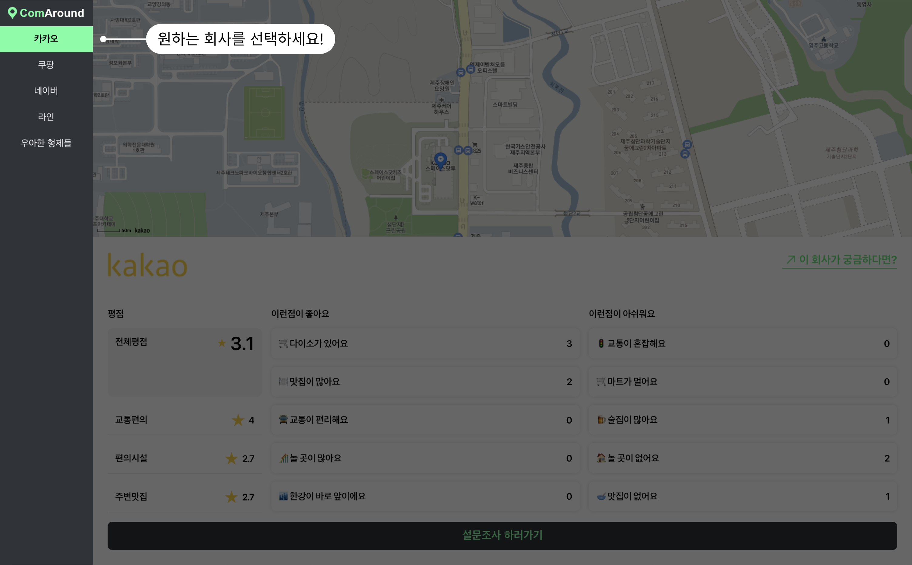
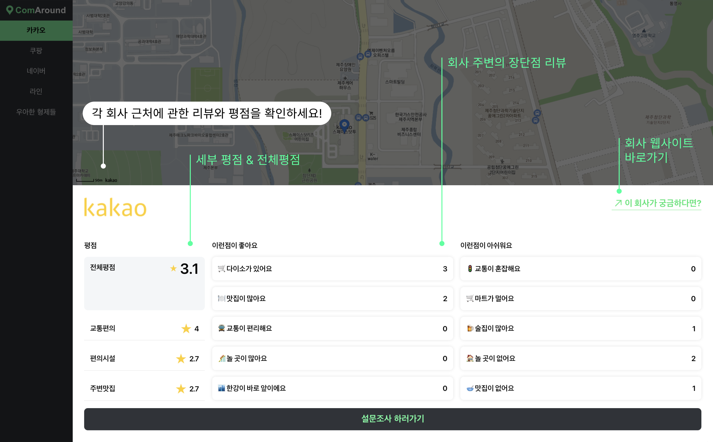
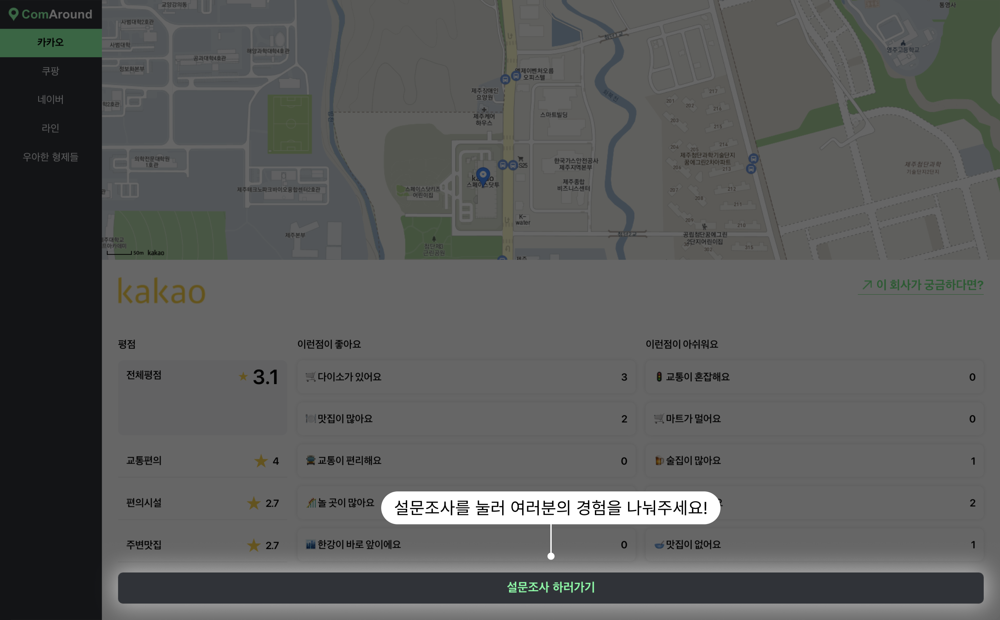
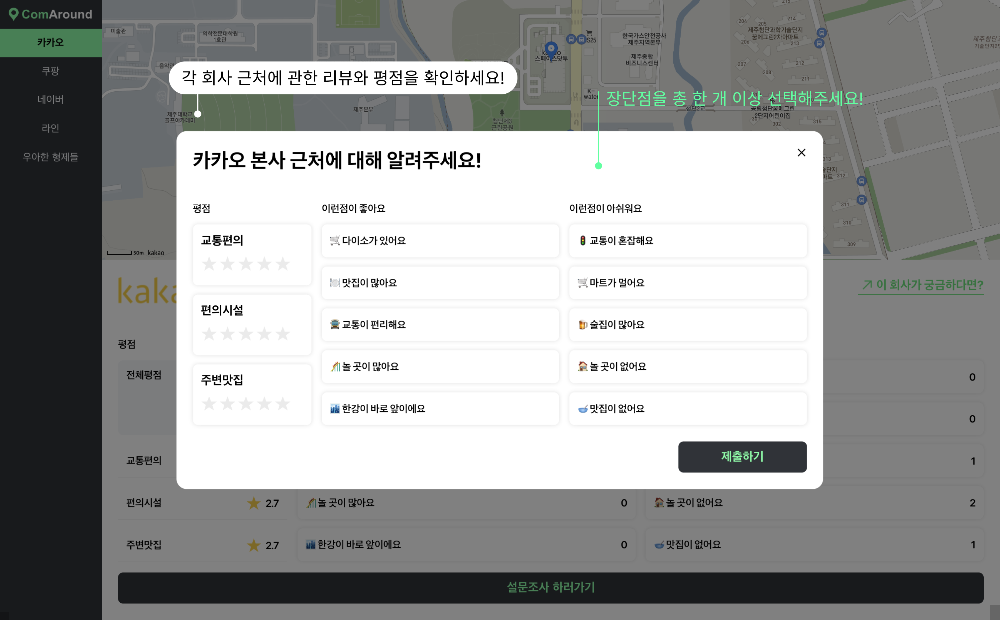
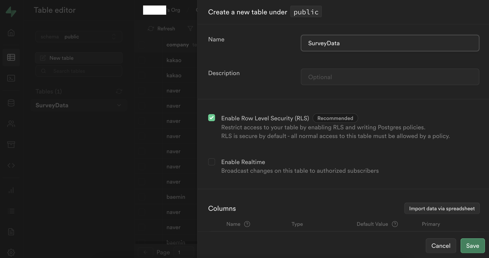
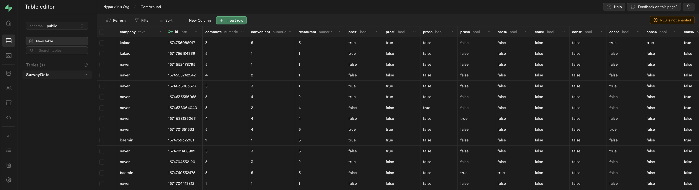
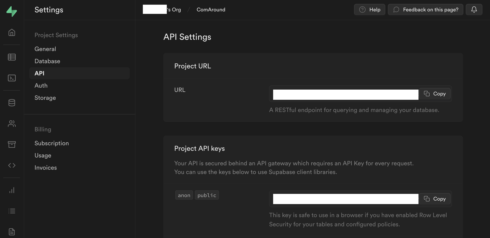

# ComAround 

**회사 동네 리뷰 웹사이트 ComAround입니다.**

원하는 회사는 찾았는데, 회사가 있는 동네는 어떨지 궁금하지 않으셨나요?
<br>
’ComAround’를 통해 당신의 궁금증을 해결하세요!
<br>
다른 사람들과 동네 정보를 공유하고, 생생한 평점도 확인할 수 있어요!
<br>
<br>
👉 [웹사이트 바로가기](https://com-around.vercel.app/)

# Key Features

1. **지도 :** 회사 선택 시 회사 주변을 지도로 보여줍니다.
2. **회사 주변 리뷰 :** 설문조사를 통해 회사 주변 생활 인프라를 소개합니다.

# Usage






# Installation

- 당신만의 ComAround를 만들고 싶다면 아래의 내용을 따라 하세요!
- Supabase에 가입합니다. ([Supabase 웹사이트 바로가기](https://supabase.com/))
- Supabase에서 'SurveyData'라는 이름으로 database table을 생성합니다.
  
- database tables의 구조는 아래와 같습니다.
  
- ComAround repo를 클론 합니다. (Git과 Node.js 필요)

```
# Clone this repository
$ git clone <https://github.com/dypark26/ComAround.git>
$ git clone git@github.com:dypark26/ComAround.git

# Go into the repository
$ cd ComAround

# Install dependencies
$ npm install

```

- supabase의 Settings - API 에서 URL과 ANON_KEY를 확인합니다.
  

- .env 파일을 생성하고 Supabase에서 제공한 URL과 ANON_KEY를 저장합니다.
  

- .env 수정 후 파일을 저장하고 IDE 종료 후 다시 실행합니다.

- 프로젝트를 실행합니다.

```
# Run the app
$ npm start

```
